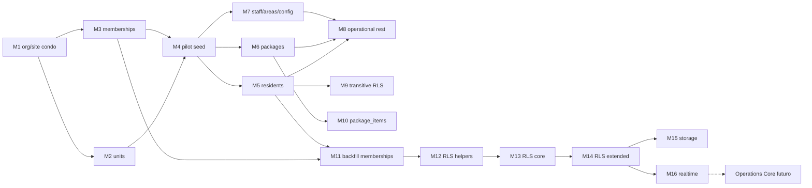

# Fase 1 — Plano de migrations M1–M16 (multi-tenant)

**Status:** especificação revisada Operaut — **nenhuma migration executada**  
**Última revisão:** 2026-08-12 (revisão pós [OPERAUT-ARCHITECTURE-ADDENDUM.md](./OPERAUT-ARCHITECTURE-ADDENDUM.md))  
**Project Supabase (produção):** `zaemlxjwhzrfmowbckmk`  
**Referência arquitetural:** [FASE-1-ARQUITETURA-MULTITENANT.md](./FASE-1-ARQUITETURA-MULTITENANT.md)  
**Addendum Operaut:** [OPERAUT-ARCHITECTURE-ADDENDUM.md](./OPERAUT-ARCHITECTURE-ADDENDUM.md)

**Cadeia documental:**

```
FASE-1-ARQUITETURA-MULTITENANT
             +
FASE-1-MIGRATION-PLAN (este arquivo)
             ↓
OPERAUT-ARCHITECTURE-ADDENDUM
             ↓
M1–M16 revisados (contratos abaixo)
```

---

## Regras deste documento

| Regra | Descrição |
|-------|-----------|
| **Ordem** | M1 → M16 **sequencial**; não pular dependências |
| **DDL** | Preferir `ADD` nullable → backfill → `NOT NULL`; evitar `DROP` até estabilizar |
| **DML prod** | M4 e M11 em **transação** com plano de rollback documentado |
| **RLS** | Helpers (M12) antes de policies core (M13–M14) |
| **App** | Releases coordenados após M11–M13 (contexto tenant, offline, realtime) |
| **Gates** | M1 **só** após RLS live, backup verificável, Git baseline **e** aceite do addendum Operaut |
| **Operaut** | Eventos/n8n/automações **fora** de M1–M16 (ver § Operations Core) |
| **Vocabulário** | `condominium` = Operational Site da vertical `condominium`; `condominium_id` ≡ `site_id` no piloto |

**Convenção de risco:** 🟢 baixo | 🟡 médio | 🔴 alto (dados prod / lock / RLS regressão)

**Classificação Operaut por etapa:** CONTINUA IGUAL | PRECISA AJUSTE | (Operations Core = REPLANEJADO como fase posterior)

---

## Visão da cadeia



---

## M1 — `001_platform_org_condo`

| Campo | Conteúdo |
|-------|----------|
| **Classificação Operaut** | **PRECISA AJUSTE** |
| **Objetivo** | Criar **Organization** + **Operational Site** (tabela `condominiums`, vertical condomínio) como raiz de isolamento, sem alterar tabelas operacionais existentes. |
| **Ajuste Operaut** | Em `condominiums`: incluir `vertical` (default/`check` = `'condominium'`) **ou** comentário/constraint documentada equivalente; slug/status; doc SQL: “Operational Site — vertical condominium”. **Não** criar ainda `operational_sites` genérica nem event tables. |
| **Dependências** | Gates pré-M1 + addendum Operaut aceito. Nenhuma M2+. |
| **Tabelas afetadas** | **Novas:** `organizations`, `condominiums`. |
| **Impacto** | Schema vazio; app legado sem referência. |
| **Risco** | 🟢 |
| **Rollback** | `DROP TABLE IF EXISTS condominiums; DROP TABLE IF EXISTS organizations;` (só se M4 não rodou). |
| **Testes** | INSERT org + site condo; UNIQUE slug; `vertical='condominium'`. |
| **Critério de sucesso** | PK/FK `condominiums.organization_id`; contrato site documentado; legado intacto. |

---

## M2 — `002_units`

| Campo | Conteúdo |
|-------|----------|
| **Classificação Operaut** | **PRECISA AJUSTE** (documental) |
| **Objetivo** | Modelar **UNIT** com `condominium_id` (= site_id) e código único por site. |
| **Ajuste Operaut** | Documentar unit como espaço do site (apto no piloto; quarto/sala em verticais futuras). Sem mudar nome da tabela. |
| **Dependências** | M1. |
| **Tabelas afetadas** | **Nova:** `units`. |
| **Risco** | 🟢 |
| **Rollback** | `DROP TABLE units;` se sem FKs M5+. |
| **Testes** | UNIQUE (`condominium_id`, `code`). |
| **Critério de sucesso** | Catálogo por site; mapa `unitFormatter` → `code`. |

---

## M3 — `003_tenant_memberships`

| Campo | Conteúdo |
|-------|----------|
| **Classificação Operaut** | **PRECISA AJUSTE** |
| **Objetivo** | Criar `tenant_memberships`: `auth_user_id` + `organization_id` + `condominium_id` (site) + `role_id`. |
| **Ajuste Operaut** | Documentar membership no **site**; reservar evolução futura para membership org-only (admin multi-site / automações). UNIQUE (`auth_user_id`, `condominium_id`) permanece no piloto. |
| **Dependências** | M1; catálogo `roles`. |
| **Tabelas afetadas** | **Nova:** `tenant_memberships`. |
| **Risco** | 🟡 |
| **Rollback** | `DROP TABLE tenant_memberships;` |
| **Testes** | Duas memberships mesmo user, sites diferentes → OK; duplicate → DENY. |
| **Critério de sucesso** | Índices por `auth_user_id` e `condominium_id`; alinhado addendum §2. |

---

## M4 — `004_pilot_seed`

| Campo | Conteúdo |
|-------|----------|
| **Classificação Operaut** | **CONTINUA IGUAL** |
| **Objetivo** | Seed Organization piloto + site `"Qualivida Club Residence"` (`vertical=condominium`). |
| **Ajuste Operaut** | Registrar no runbook: primeiro **Operational Site** Operaut. |
| **Dependências** | M1–M3. |
| **Risco** | 🔴 |
| **Rollback** | Snapshot pré-M4 preferível. |
| **Testes** | 1 org + 1 site; app legado ainda opera. |
| **Critério de sucesso** | IDs piloto no runbook; base para backfills. |

---

## M5 — `005_residents_condo_id`

| Campo | Conteúdo |
|-------|----------|
| **Classificação Operaut** | **PRECISA AJUSTE** (documental) |
| **Objetivo** | `residents.condominium_id` nullable → backfill → NOT NULL + FK. |
| **Ajuste Operaut** | Coluna física `condominium_id` (= site_id). Não renomear nesta fase. |
| **Dependências** | M4. |
| **Risco** | 🟡 |
| **Rollback** | Snapshot / reverter NOT NULL+FK. |
| **Testes** | Zero NULL; 4 residents no piloto. |
| **Critério de sucesso** | FK válida; login morador OK. |

---

## M6 — `006_packages_condo_id`

| Campo | Conteúdo |
|-------|----------|
| **Classificação Operaut** | **PRECISA AJUSTE** (documental) |
| **Objetivo** | Idem M5 para `packages`. |
| **Ajuste Operaut** | Isolamento de site; **não** emitir ainda `package.registered` (Operations Core). |
| **Dependências** | M4; recomendado M5. |
| **Risco** | 🔴 |
| **Rollback** | Como M5. |
| **Testes** | CRUD encomenda piloto; 9 packages; `image_url` intacto. |
| **Critério de sucesso** | Fluxos críticos OK (UI single-tenant). |

---

## M7 — `007_staff_areas_app_config`

| Campo | Conteúdo |
|-------|----------|
| **Classificação Operaut** | **PRECISA AJUSTE** (documental) |
| **Objetivo** | `condominium_id` em `staff`, `areas`, `app_config`. |
| **Ajuste Operaut** | `app_config` = config do **site** piloto. |
| **Dependências** | M4. |
| **Risco** | 🟡 |
| **Rollback** | Como M5. |
| **Testes** | Staff login; config do site. |
| **Critério de sucesso** | NOT NULL+FK onde aplicável. |

---

## M8 — `008_operational_rest`

| Campo | Conteúdo |
|-------|----------|
| **Classificação Operaut** | **PRECISA AJUSTE** (documental) |
| **Objetivo** | Propagar `condominium_id` em occurrences, notices, visitors, boletos, reservations, chat, audit, invites, notes, crm_*. |
| **Ajuste Operaut** | Escopo de **site**; audit admin continua distinto de audit operacional futuro. |
| **Dependências** | M4–M7. |
| **Risco** | 🔴 |
| **Rollback** | Snapshot / ordem inversa. |
| **Testes** | Smoke por módulo. |
| **Critério de sucesso** | Sem orphans de site onde coluna exigida. |

---

## M9 — `009_notifications_transitive_rls`

| Campo | Conteúdo |
|-------|----------|
| **Classificação Operaut** | **CONTINUA IGUAL** (+ nota) |
| **Objetivo** | RLS `notifications` / `notice_reads` via residents/notices. |
| **Ajuste Operaut** | Tratar `notifications` como **canal inbox**, não event store (addendum §6). |
| **Dependências** | M5, M8; **M12 antes** se usar helpers. |
| **Risco** | 🔴 |
| **Rollback** | Restaurar policies do export live. |
| **Testes** | Inbox scoped ao site. |
| **Critério de sucesso** | Policies documentadas; anon bloqueado onde esperado. |

**Runbook:** **M8 → M11 → M12 → M9 → M10 → M13 → M14**.

---

## M10 — `010_package_items_transitive`

| Campo | Conteúdo |
|-------|----------|
| **Classificação Operaut** | **CONTINUA IGUAL** |
| **Objetivo** | RLS `package_items` via `packages.condominium_id`. |
| **Dependências** | M6; M12. |
| **Risco** | 🟡 |
| **Rollback** | DROP policies novas; restaurar export. |
| **Testes** | Cross-site DENY quando existir site B. |
| **Critério de sucesso** | Items isolados por site do package. |

---

## M11 — `011_memberships_backfill`

| Campo | Conteúdo |
|-------|----------|
| **Classificação Operaut** | **CONTINUA IGUAL** |
| **Objetivo** | Backfill `tenant_memberships` a partir de users/staff/residents. |
| **Ajuste Operaut** | Memberships no site piloto; base para Central/ops depois. |
| **Dependências** | M3, M4, M5–M7. |
| **Risco** | 🔴 |
| **Rollback** | Snapshot / truncate controlado. |
| **Testes** | 100% auth operacionais com membership active. |
| **Critério de sucesso** | Sem órfãos críticos. |

---

## M12 — `012_rls_helpers`

| Campo | Conteúdo |
|-------|----------|
| **Classificação Operaut** | **PRECISA AJUSTE** |
| **Objetivo** | `current_condominium_id()`, `is_member()`, `has_permission(key)` (DEFINER controlado). |
| **Ajuste Operaut** | Documentar alias: `current_site_id()` ≡ `current_condominium_id()` no piloto (função alias opcional ou sinônimo na doc). Preparar extensão futura de permissions Operaut sem criar keys agora. |
| **Dependências** | M3, M11. |
| **Risco** | 🔴 |
| **Rollback** | DROP FUNCTION ordem deps. |
| **Testes** | is_member(piloto); has_permission alinhado a role_permissions. |
| **Critério de sucesso** | search_path fixo; EXECUTE restrito. |

---

## M13 — `013_rls_policies_core`

| Campo | Conteúdo |
|-------|----------|
| **Classificação Operaut** | **CONTINUA IGUAL** |
| **Objetivo** | RLS core: packages, residents, notifications. |
| **Dependências** | M12; M5; M6. |
| **Risco** | 🔴 |
| **Rollback** | Policies do Gate RLS live. |
| **Testes** | Matriz site A/B; regressão encomendas. |
| **Critério de sucesso** | Isolamento site; piloto intacto. |

---

## M14 — `014_rls_policies_extended`

| Campo | Conteúdo |
|-------|----------|
| **Classificação Operaut** | **CONTINUA IGUAL** |
| **Objetivo** | RLS restante tenant-owned. |
| **Dependências** | M12, M13, M8. |
| **Risco** | 🔴 |
| **Rollback** | Export live obrigatório. |
| **Testes** | Matriz A/B completa. |
| **Critério de sucesso** | Sem `USING (true)` crítico inadvertido. |

---

## M15 — `015_storage_policies_paths`

| Campo | Conteúdo |
|-------|----------|
| **Classificação Operaut** | **PRECISA AJUSTE** |
| **Objetivo** | Paths tenant + policies `storage.objects`. |
| **Ajuste Operaut** | Path piloto: `organizations/{org}/condominiums/{site}/…` documentado como equivalente a `…/sites/{site}/…`. Evitar paths sem org/site. |
| **Dependências** | M4, M14; Gate Storage. |
| **Risco** | 🔴 |
| **Rollback** | Policies export + prefixo antigo. |
| **Testes** | Upload/download piloto; cross-site DENY. |
| **Critério de sucesso** | Isolamento Storage por site. |

---

## M16 — `016_realtime_publication`

| Campo | Conteúdo |
|-------|----------|
| **Classificação Operaut** | **PRECISA AJUSTE** |
| **Objetivo** | Realtime filtrado por `condominium_id`; canais app `condo:{id}:…`. |
| **Ajuste Operaut** | Documentar alias `site:{id}:…`. **Não** criar ainda canal de `operational_events` (Operations Core). |
| **Dependências** | M8, M14; deploy app coordenado. |
| **Risco** | 🟡 |
| **Rollback** | Publication + canais legados. |
| **Testes** | INSERT site A → subscriber B não recebe. |
| **Critério de sucesso** | Sem `*-global` em multi-tenant. |

---

## Operations Core (pós M16 — não é M1–M16)

**Classificação:** **PRECISA REPLANEJAMENTO** como fase própria (não numerar como M1–M16).

| Bloco futuro | Conteúdo conceitual |
|--------------|---------------------|
| OC1 | `operational_events` + outbox |
| OC2 | regras / automations / runs |
| OC3 | webhooks assinados → n8n + callbacks |
| OC4 | canais (WhatsApp, e-mail, push) + delivery logs |
| OC5 | audit operacional unificado |
| OC6 | permissions Operaut (`operations.*`, `automations.*`, …) |
| OC7 | Central de Operações (UI) + KPIs/SLA |

**Dependência:** isolamento M11–M14 estável no piloto.  
**Proibido:** acoplar domínio → n8n direto.

---

## Ordem de execução recomendada (runbook)

| Fase | Migrations | Observação |
|------|------------|------------|
| Estrutura tenant/site | M1 → M2 → M3 | Contrato vertical/site (addendum) |
| Seed piloto | M4 | Snapshot pós-M4 |
| Colunas site (`condominium_id`) | M5 → M6 → M7 → M8 | Backfills |
| Membership | M11 | Antes RLS pesado |
| Helpers | **M12** | Alias site documentado |
| Transitivo | M9 → M10 | Após M12 |
| RLS amplo | M13 → M14 | Export policies |
| Periféricos | M15 → M16 | Paths/canais com vocabulário site |
| Depois | Operations Core | Eventos / n8n / Central |

---

## Checklist por migration (operador)

Antes de **cada** Mi:

- [ ] Backup/snapshot confirmado pós Mi-1  
- [ ] Migration SQL revisada (PR) + nota Operaut (site/vertical)  
- [ ] Janela de manutenção se 🔴  
- [ ] Rollback script anexado ao PR  
- [ ] Testes smoke executados e registrados  
- [ ] **Não** incluir eventos/n8n/WhatsApp em M1–M16  

---

## Pré-condições para autorizar M1

- [ ] RLS live (D1) com evidência  
- [ ] Storage live (D2 + D5) com evidência  
- [ ] Backup verificável  
- [ ] Git baseline `pre-multitenant-baseline` intacto  
- [x] Addendum Operaut publicado  
- [x] M1–M16 revisados (este documento)  
- [ ] Aceite explícito do addendum + deste plano  
- [ ] Autorização explícita para executar M1  

**Estado atual:** M1 **BLOQUEADA**.

---

*Plano documental revisado Operaut. Não substitui autorização explícita para executar M1.*
