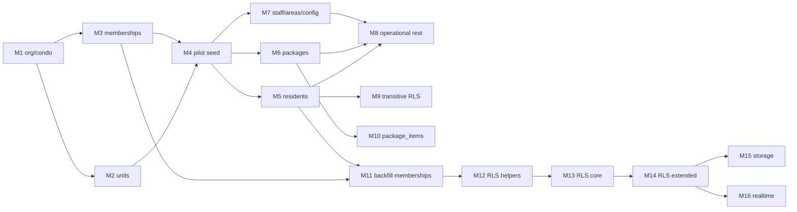

# Fase 1 — Plano de migrations M1–M16 (multi-tenant)

**Status:** especificação aprovada — **nenhuma migration executada**  
**Última revisão:** 2026-08-08  
**Project Supabase (produção):** `zaemlxjwhzrfmowbckmk`  
**Referência arquitetural:** [FASE-1-ARQUITETURA-MULTITENANT.md](./FASE-1-ARQUITETURA-MULTITENANT.md)

---

## Regras deste documento

| Regra | Descrição |
|-------|-----------|
| **Ordem** | M1 → M16 **sequencial**; não pular dependências |
| **DDL** | Preferir `ADD` nullable → backfill → `NOT NULL`; evitar `DROP` até estabilizar |
| **DML prod** | M4 e M11 em **transação** com plano de rollback documentado |
| **RLS** | Helpers (M12) antes de policies core (M13–M14) |
| **App** | Releases coordenados após M11–M13 (contexto tenant, offline, realtime) |
| **Gates** | M1 **só** após RLS live, backup verificável e Git baseline (ver arquitetura §21) |

**Convenção de risco:** 🟢 baixo | 🟡 médio | 🔴 alto (dados prod / lock / RLS regressão)

---

## Visão da cadeia

---

## M1 — `001_platform_org_condo`

| Campo | Conteúdo |
|-------|----------|
| **Objetivo** | Criar camada **Organization** e **Condominium** como raiz do isolamento tenant, sem alterar tabelas operacionais existentes. |
| **Dependências** | Gates pré-M1 fechados (RLS export, backup, Git baseline). Nenhuma migration M2+ aplicada. |
| **Tabelas afetadas** | **Novas:** `organizations`, `condominiums`. **Existentes:** nenhuma alteração estrutural. |
| **Impacto** | Schema vazio utilizável; app legado **não** referencia ainda estas tabelas. Zero impacto runtime se não houver FKs de app. |
| **Risco** | 🟢 — apenas CREATE de tabelas novas. |
| **Rollback** | `DROP TABLE IF EXISTS condominiums; DROP TABLE IF EXISTS organizations;` (somente se M4 **não** tiver rodado). Após M4, rollback exige remover FKs dependentes na ordem inversa. |
| **Testes** | SQL: INSERT org + condo de teste em ambiente staging; verificar UNIQUE em `slug` (se definido); SELECT como `authenticated` (policies mínimas read se já criadas). |
| **Critério de sucesso** | Tabelas existem com PK/FK `condominiums.organization_id`, índices de busca (`slug`, `status`), migration versionada no repo; **nenhuma** tabela legada quebrada. |

---

## M2 — `002_units`

| Campo | Conteúdo |
|-------|----------|
| **Objetivo** | Modelar **UNIT** com `condominium_id` e código único por condomínio. |
| **Dependências** | M1 (`condominiums`). |
| **Tabelas afetadas** | **Nova:** `units`. |
| **Impacto** | Prepara backfill futuro de `residents.unit` / `packages.unit`; app continua usando strings até fase app. |
| **Risco** | 🟢 |
| **Rollback** | `DROP TABLE units;` se sem FKs de M5+. |
| **Testes** | UNIQUE (`condominium_id`, `code`); INSERT unidades piloto; tentativa duplicate → falha. |
| **Critério de sucesso** | Catálogo de unidades consultável por `condominium_id`; documentação de mapeamento `unitFormatter` → `code`. |

---

## M3 — `003_tenant_memberships`

| Campo | Conteúdo |
|-------|----------|
| **Objetivo** | Criar **`tenant_memberships`** — vínculo canônico `auth_user_id` + `organization_id` + `condominium_id` + `role_id`. |
| **Dependências** | M1; catálogo `roles` existente (RBAC). |
| **Tabelas afetadas** | **Nova:** `tenant_memberships`. FKs → `auth.users` (via uuid), `organizations`, `condominiums`, `roles`. |
| **Impacto** | Tabela vazia até M11; **não** substituir `users.role` até app + RLS. |
| **Risco** | 🟡 — constraints UNIQUE (`auth_user_id`, `condominium_id`) devem ser validadas contra dados futuros (M11). |
| **Rollback** | `DROP TABLE tenant_memberships;` |
| **Testes** | INSERT duas memberships mesmo user, condos diferentes → OK; duplicate (user, condo) → DENY; FK inválida → DENY. |
| **Critério de sucesso** | Schema alinhado à spec §5; índices para lookup por `auth_user_id` e `condominium_id`. |

---

## M4 — `004_pilot_seed`

| Campo | Conteúdo |
|-------|----------|
| **Objetivo** | Inserir **Organization piloto** + **Condominium** `"Qualivida Club Residence"` (primeiro tenant formal). |
| **Dependências** | M1, M2 (opcional units vazias), M3 (estrutura pronta; memberships ainda em M11). |
| **Tabelas afetadas** | `organizations`, `condominiums` (**DML**). Opcional: `units` DISTINCT de `residents`/`packages`. |
| **Impacto** | 🔴 **Primeiro DML prod** multi-tenant; IDs fixos ou slugs documentados para backfills M5–M11. |
| **Risco** | 🔴 — erro de seed duplicado ou org errada contamina backfill. |
| **Rollback** | DELETE pilot rows **somente** se M5–M11 não referenciarem `condominium_id`; preferir snapshot pré-M4. |
| **Testes** | Contagem 1 org + 1 condo; slugs únicos; app legado ainda opera (sem depender de condo_id). |
| **Critério de sucesso** | IDs piloto registrados em runbook; unidades derivadas batem amostra (4 residents, 9 packages baseline Fase 0). |

---

## M5 — `005_residents_condo_id`

| Campo | Conteúdo |
|-------|----------|
| **Objetivo** | Adicionar `condominium_id` em `residents`: nullable → backfill piloto → NOT NULL + FK. |
| **Dependências** | M4 (condo piloto ID). |
| **Tabelas afetadas** | `residents`. |
| **Impacto** | Todas as linhas existentes apontam para tenant piloto; queries sem filtro condo ainda possíveis até RLS (M13). |
| **Risco** | 🟡 — backfill errado isola morador no condo errado. |
| **Rollback** | Remover NOT NULL + FK; zerar coluna ou restore snapshot; **não** DROP coluna em prod sem backup. |
| **Testes** | `count(*) WHERE condominium_id IS NULL` = 0 pós-NOT NULL; amostra manual 4 residents = piloto. |
| **Critério de sucesso** | FK válida; zero orphans; regressão login morador no piloto. |

---

## M6 — `006_packages_condo_id`

| Campo | Conteúdo |
|-------|----------|
| **Objetivo** | Idem M5 para **`packages`** (encomendas — fluxo crítico). |
| **Dependências** | M4; recomendado M5 (consistência resident/package no mesmo condo). |
| **Tabelas afetadas** | `packages`. |
| **Impacto** | 9 packages baseline → piloto; portaria/QR/foto/voz dependem de SELECT/INSERT corretos. |
| **Risco** | 🔴 — regressão encomendas. |
| **Rollback** | Como M5; manter snapshot pré-M6. |
| **Testes** | CRUD encomenda manual + recipient morador piloto; contagem 9; `image_url` intacto. |
| **Critério de sucesso** | Zero NULL; FK; fluxos críticos manuais OK no tenant piloto (UI ainda single-tenant). |

---

## M7 — `007_staff_areas_app_config`

| Campo | Conteúdo |
|-------|----------|
| **Objetivo** | `condominium_id` em **`staff`**, **`areas`**, **`app_config`**. |
| **Dependências** | M4. |
| **Tabelas afetadas** | `staff`, `areas`, `app_config`. |
| **Impacto** | Config condomínio (1 row) vinculada ao piloto; staff 1 → piloto. |
| **Risco** | 🟡 |
| **Rollback** | Reverter colunas como M5. |
| **Testes** | staff login; áreas/reservas se usadas; `app_config` single row com condo correto. |
| **Critério de sucesso** | NOT NULL + FK onde aplicável; reservas continuam respeitando trigger 003. |

---

## M8 — `008_operational_rest`

| Campo | Conteúdo |
|-------|----------|
| **Objetivo** | Propagar `condominium_id` (direct) em: `occurrences`, `notices`, `visitors`, `boletos`, `reservations`, `chat_messages`, `admin_audit_logs`, `staff_invites`, `resident_invites`, `notes`, `crm_*` (se existirem). |
| **Dependências** | M4–M7; M5/M6 para coerência transitiva onde houver FK resident/package. |
| **Tabelas afetadas** | Lista acima (conforme existência no schema live). |
| **Impacto** | Grande superfície operacional; many backfills. |
| **Risco** | 🔴 |
| **Rollback** | Por tabela ou snapshot; ordem inversa de ALTER. |
| **Testes** | Smoke por módulo: ocorrências, mural, visitantes, boletos (se dados), chat, convites. |
| **Critério de sucesso** | Nenhuma linha operacional sem `condominium_id` onde coluna exigida; FKs consistentes. |

---

## M9 — `009_notifications_transitive_rls`

| Campo | Conteúdo |
|-------|----------|
| **Objetivo** | RLS/policies para **`notifications`**, **`notice_reads`** via join `notices` / `residents` (transitivo). |
| **Dependências** | M5, M8 (`notices` com condo_id); M12 **recomendado antes** se policies usarem helpers — **ajuste operacional:** aplicar M12 antes de M9 se scripts dependem de `is_member()`. |
| **Nota de ordem** | Na cadeia original M9 precede M12; na prática **M12 deve preceder M9/M10/M13** se policies referenciarem helpers. Registrar: executar **M12 imediatamente antes de M9** ou fundir helpers em migration anterior a M9. |
| **Tabelas afetadas** | `notifications`, `notice_reads`; policies substituem `USING (true)` legado. |
| **Impacto** | Morador só vê inbox do seu condo; risco de lockout se policy errada. |
| **Risco** | 🔴 |
| **Rollback** | Restaurar policies anteriores (export Anexo D obrigatório pré-M9); ou snapshot. |
| **Testes** | Morador A não SELECT notification de morador B (condo futuro B); piloto single-tenant ainda passa. |
| **Critério de sucesso** | Policies documentadas; anon não lê inbox; authenticated scoped. |

**Correção de dependência (canônica para execução):** tratar **M12 antes de M9, M10, M13, M14**. A numeração M9–M14 permanece; runbook: **M8 → M11 → M12 → M9 → M10 → M13 → M14**.

---

## M10 — `010_package_items_transitive`

| Campo | Conteúdo |
|-------|----------|
| **Objetivo** | RLS em **`package_items`** via `package_id → packages.condominium_id` (trigger opcional de consistência). |
| **Dependências** | M6; M12 (helpers). |
| **Tabelas afetadas** | `package_items`. |
| **Impacto** | Itens de encomenda seguem isolamento do pacote. |
| **Risco** | 🟡 |
| **Rollback** | DROP policies novas; restaurar anteriores do export live. |
| **Testes** | INSERT item em package piloto OK; cross-condo (quando existir B) DENY. |
| **Critério de sucesso** | Sem acesso a items de package de outro condo. |

---

## M11 — `011_memberships_backfill`

| Campo | Conteúdo |
|-------|----------|
| **Objetivo** | Popular **`tenant_memberships`** a partir de `users`, `staff`, `residents` (`auth_user_id`) sem duplicar Auth. |
| **Dependências** | M3, M4, M5–M7 (condo_id nos perfis). |
| **Tabelas afetadas** | `tenant_memberships` (**DML**). |
| **Impacto** | Base para autorização contextual; 4 users → até 4 memberships piloto. |
| **Risco** | 🔴 — role_id errado = permissões erradas. |
| **Rollback** | TRUNCATE memberships (se app ainda usa legado); snapshot preferível. |
| **Testes** | Cada auth ativo tem membership piloto; `role_id` bate matriz negócio; multi-condo futuro: 2 linhas mesmo auth. |
| **Critério de sucesso** | 100% usuários operacionais piloto com membership `active`; nenhum auth órfão crítico. |

---

## M12 — `012_rls_helpers`

| Campo | Conteúdo |
|-------|----------|
| **Objetivo** | Funções **`current_condominium_id()`**, **`is_member()`**, **`has_permission(key)`** (SECURITY DEFINER controlado) usando `tenant_memberships` + RBAC. |
| **Dependências** | M3, M11 (memberships populadas para testes realistas). |
| **Tabelas afetadas** | Nenhuma tabela; **funções** novas/alteradas. |
| **Impacto** | Fundação de todas policies M9–M14. |
| **Risco** | 🔴 — DEFINER mal definido = escalada privilégio. |
| **Rollback** | DROP FUNCTION (ordem dependências); restaurar funções do dump pré-M12. |
| **Testes** | Unit SQL: user com membership piloto → `is_member(pilot_id)` true; sem membership → false; `has_permission` alinhado a `role_permissions`. |
| **Critério de sucesso** | Funções imutáveis documentadas; search_path fixo; revogar EXECUTE público onde necessário. |

---

## M13 — `013_rls_policies_core`

| Campo | Conteúdo |
|-------|----------|
| **Objetivo** | Policies tenant-scoped em **`packages`**, **`residents`**, **`notifications`** (core portaria + morador). |
| **Dependências** | M12; M5, M6, M9 (notifications pode overlap — consolidar policies duplicadas). |
| **Tabelas afetadas** | `packages`, `residents`, `notifications`. |
| **Impacto** | **Mudança de postura de segurança** vs. `USING (true)`; pode quebrar anon. |
| **Risco** | 🔴 |
| **Rollback** | Recriar policies do arquivo exportado (Gate RLS live); snapshot. |
| **Testes** | Matriz TENANT A/B (spec §16); regressão encomendas piloto; staff SELECT packages. |
| **Critério de sucesso** | User A não acessa packages/residents B; piloto intacto; anon bloqueado onde esperado. |

---

## M14 — `014_rls_policies_extended`

| Campo | Conteúdo |
|-------|----------|
| **Objetivo** | RLS restante: `occurrences`, `notices`, `visitors`, `boletos`, `reservations`, `chat_messages`, `staff`, convites, audit, etc. |
| **Dependências** | M12, M13, M8. |
| **Tabelas afetadas** | Demais tenant-owned (ver classificação arquitetura §8). |
| **Impacto** | Fechamento enforcement Postgres. |
| **Risco** | 🔴 |
| **Rollback** | Idem M13 — **obrigatório** baseline policies live arquivado. |
| **Testes** | Matriz A/B completa; RPC RBAC admin; convites scoped. |
| **Critério de sucesso** | Nenhuma tabela operacional crítica com `USING (true)` inadvertido; checklist Fase 0 RLS resolvida. |

---

## M15 — `015_storage_policies_paths`

| Campo | Conteúdo |
|-------|----------|
| **Objetivo** | Prefixos `organizations/.../condominiums/.../`; policies **`storage.objects`**; migrar/copiar objetos legados (`boletos/original/...`). |
| **Dependências** | M4, M14 (membership coerente); export **`storage.buckets`** live (Gate Storage). |
| **Tabelas afetadas** | `storage.buckets` (metadados), `storage.objects` (policies + paths). |
| **Impacto** | URLs antigas podem precisar redirect; bucket `boletos` hoje público read (repo). |
| **Risco** | 🔴 — perda acesso PDF; upload encomenda se migrar buckets imagens. |
| **Rollback** | Restaurar policies storage do export; manter cópia prefixo antigo (spec §17). |
| **Testes** | Upload/download piloto; sessão B DENY objeto A; list bucket scoped. |
| **Critério de sucesso** | Isolamento Storage alinhado §11 arquitetura; objetos piloto acessíveis. |

---

## M16 — `016_realtime_publication`

| Campo | Conteúdo |
|-------|----------|
| **Objetivo** | Publication/filtros Realtime por `condominium_id`; alinhar canais app (`condo:{id}:...`). |
| **Dependências** | M8 (coluna condo); M14; **deploy app** com canais novos (fora desta migration). |
| **Tabelas afetadas** | `supabase_realtime` publication; tabelas com REPLICA IDENTITY se necessário. |
| **Impacto** | Eventos cross-tenant cessam após app + publication alinhados. |
| **Risco** | 🟡 — realtime silencioso se filtro errado. |
| **Rollback** | Reverter publication; redeploy app canais globais legado. |
| **Testes** | INSERT package A → subscriber B não recebe; piloto recebe. |
| **Critério de sucesso** | Spec §13 atendida; sem `*-global` em produção multi-tenant. |

---

## Ordem de execução recomendada (runbook)

| Fase | Migrations | Observação |
|------|------------|------------|
| Estrutura tenant | M1 → M2 → M3 | Sem DML prod |
| Seed piloto | M4 | Snapshot imediato pós-M4 |
| Colunas condo | M5 → M6 → M7 → M8 | Backfills; validar contagens |
| Membership | M11 | Antes RLS pesado |
| Helpers | **M12** | Antes M9, M10, M13, M14 |
| Transitivo | M9 → M10 | Após M12 |
| RLS amplo | M13 → M14 | Baseline policies arquivado |
| Periféricos | M15 → M16 | Com app coordenado |

---

## Checklist por migration (operador)

Antes de **cada** Mi:

- [ ] Backup/snapshot confirmado pós Mi-1  
- [ ] Migration SQL revisada (PR)  
- [ ] Janela de manutenção se 🔴  
- [ ] Rollback script anexado ao PR  
- [ ] Testes smoke executados e registrados  

---

*Plano documental. Não substitui autorização explícita para executar M1.*
